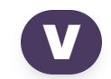

  

# Vault - Student Management System

## Introduction
Welcome to **Vault**, a comprehensive student management system designed to streamline classroom interactions and administrative tasks. This platform enables teachers to efficiently manage attendance and grading, while providing students with a portal for submitting assignments and tracking their academic progress. Our goal is to simplify educational processes, making them more accessible and effective for both educators and students.

## Key Features
- **Attendance Tracking**: Teachers can easily mark attendance, view historical data, and generate reports.
- **Assignment Submission**: A secure portal for students to submit their assignments directly to their teachers.
- **Grading System**: Automated grading tools that allow teachers to quickly evaluate student submissions and provide timely feedback.
- **Progress Tracking**: Students can track their academic progress through a personalized dashboard.

## Technologies Used
Vault leverages several cutting-edge technologies to provide a robust and user-friendly experience:
- **HTML5**: For structuring and presenting content on the Internet.
- **Tailwind CSS**: For styling and building responsive interfaces with design consistency.
- **NodeJS**: For handling server-side logic and database interactions.
- **ReactJS**: For creating dynamic and interactive user interfaces in a modular and efficient way.

## Team Members
| Name              | Role in Project       | Contact Information          |
|-------------------|-----------------------|------------------------------|
| Nguyễn Quang Duy  | FullStack Developer   | nqduy.ityu@gmail.com         |
| Nguyễn Bá Phúc    | Back-end Developer    | phucnguyenba217@gmail.com    |
|                   | UI/UX Designer        |                              |
| Trần Đức Hải Triều| Front-end Developer   | Darkdarkinblade@gmail.com    |

## Getting Started
To get started with Vault, teachers and students need to register and create their respective accounts. Once logged in, teachers can access the administrative panel, while students are directed to their personal dashboard.

## Development and Contributions
We encourage community involvement in the ongoing development of Vault. If you are interested in contributing, please fork the repository, make your changes, and submit a pull request. For bugs or feature requests, please open an issue on our GitHub page.

## License
Vault is open-sourced under the MIT license and is free for commercial and non-commercial use.

---
Vault is committed to enhancing the educational experience by providing tools that are both innovative and intuitive.
